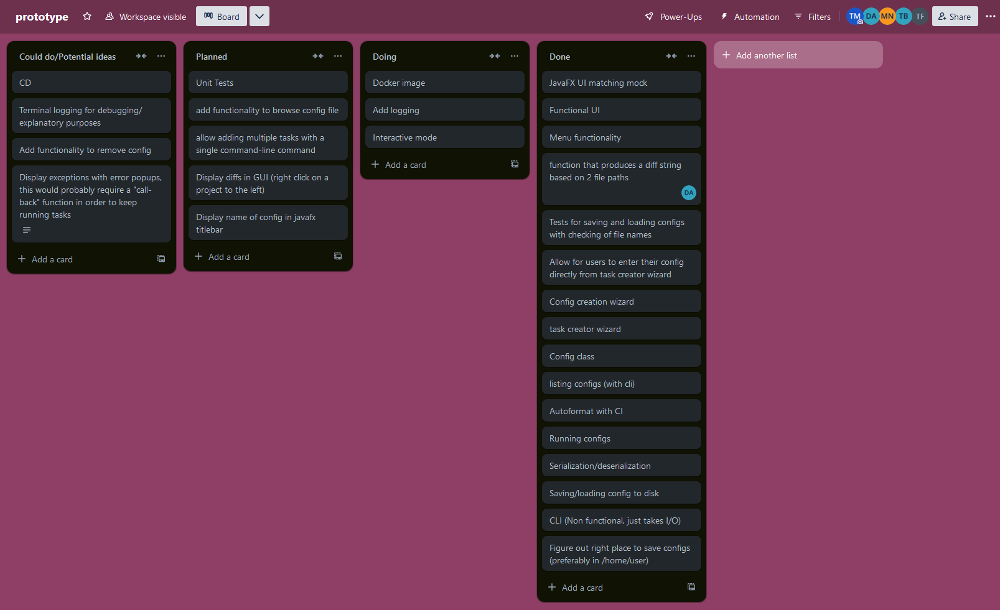
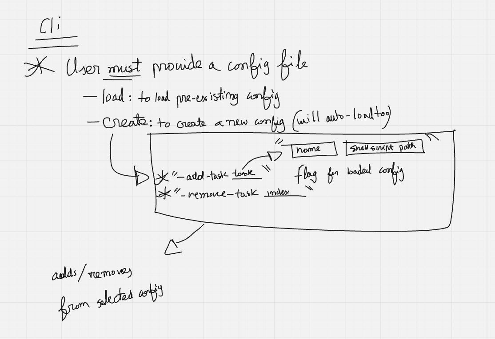

# Report

## Which EDR was chosen...
note: improve this section
We decided to go with my EDR as we felt it was most appropriate

We had a few days left so we decided to forego doing CLI only and implemented a very barebones (but functional) GUI with the use of javafx.
## How was it accomplished

We use a trello board to keep track of all our tasks, the team leader (Tahasin) adds all the new tasks that should be completed, we have the standard 4 Lists:
- Suggestions
- Planned
- Doing
- Done

Using a trello board helps keep track of all the tasks that we have already completed and the ones that still need doing and allows for us to keep ourselves busy with tasks after we finish one.

We also used Miro which is an online collaborative whiteboard tool for expressing ideas in a more visual manner without having to do in-person meetings.

Before we begin working we start a meeting where we each pick out a task to do by the end of the day so that we are all at least doing something at the same time. When assigning task we take the task we are most comfortable with to ensure that everyone's skills and expertise are being used and when there isn't a task that someone is already comfortable with (e.g. they already know the part of the codebase required to complete the task or they know the tooling used to complete task) then we assign anyone who is free and give them some extra time so that they can get familiar with it.

We used git as our version control software along GitHub for hosting the git repository. Tahasin hosts a repository on GitHub and the rest of the team make forks of the repository to make changes in and send pull requests which are reviewed by Tahasin. When there is a merge conflict, Tahasin should be the one to manually resolve it.

We used gradle for our build tool as its a cross platform tool with the binary for it being pre-packaged with the repository which simplifies our workflow as we work on multiple different platforms (Windows and Linux) and it ensures that nobody is missing the binary.
Gradle also helps with dependency management as it can automatically download the required libraries from the `build.gradle.kts` file.

Since we all have different coding styles, we run a CI job to automatically format all the files making the code style more consistent and readable. We also use another CI job to ensure that with each commit and pull request all the code compiles and the tests run successfully using gradle and also upload the gradle test report as a downloadable artifact to GitHub so that for any test which may have failed can be seen without having to download and run the code locally.

Due to the way our project is designed we are running shell script which can run arbitrary code and potentially malicious code. So we created a docker file that would allow for the program to be ran inside a of a docker container. Doing so mean's that the program is only allowed access to the program binary and the student submissions and no more, this way the host machine cannot be harmed in any way and no personal data should be accessible.

## Student reflections

<!---
250 words/student for each person, please fill out your sections under the header with your name and give 250 words for other colleagues, do NOT write under other people's headers unless it is to fix a spelling error without asking for permission first.
-->

### Dahir Abdulkadir

### Toby Brocas

### Tahasin Muaz

### Mohammed Nahiyan
